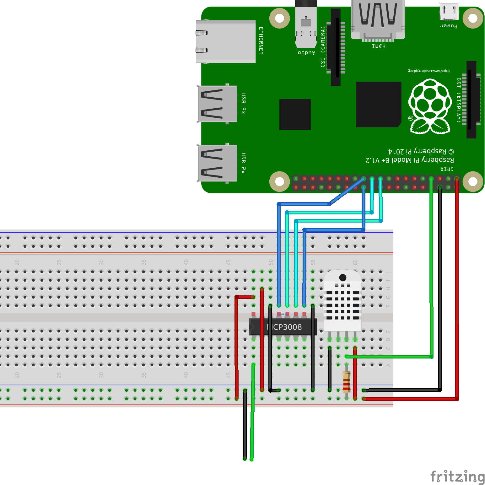

to set up the node we need:

- Raspberry Pi (tested on 2 model B)
- One led
- One DHT22 sensor

##Connections:

###LED:
- Anode to 220 Ohms resistance and the resistance to vcc (3.3V)
- Cathode to GPIO27

###DHT22:
- Pin 1 to vcc (3.3V)
- Pin 2 to vcc (3.3V) with a 10K Ohms resistance between them and to GPIO04
- Pin 3 disconnected
- Pin 4 to GND
 

